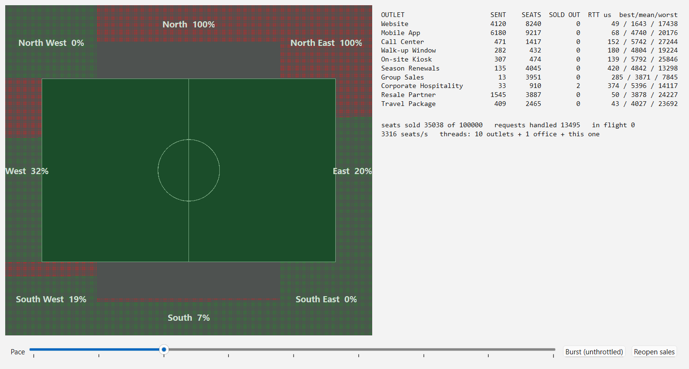

# Event loop as a thread: a stadium box office (Qt Widgets)

Ten outlets sell tickets at the same time. One box office owns the seating plan. There is no mutex, no lock and no atomic anywhere in this code, and you can grep it to check.

The idea this demo exists to show is that an event loop is the best encapsulation of a thread. Put the shared data inside the object that owns the loop, reach it only by posting messages, and the queue serialises every access for you. Mutual exclusion gets replaced by message passing, and the whole category of lock ordering, contention and torn reads never arises. I wrote about why I think this is underrated in [Event loops are underrated](https://makarandkokane.github.io/articles/event-loops-are-underrated.html).

Note what is NOT happening here: several threads working on one object. That is the world with the mutexes in it. Here, ten threads *send to* the object and exactly one thread ever *touches* its data.

## What you are looking at

`BoxOffice` holds 100,000 seats in eight blocks and lives in its own thread. Ten `BookingAgent` instances, each on its own thread, are the outlets a real ground sells through: website, mobile app, call centre, walk-up window, on-site kiosk, season renewals, group sales, corporate hospitality, resale partner, travel package. Twelve threads in total once you count the GUI.

Their profiles differ on purpose, because that is where the interesting contention comes from. The mobile app fires hundreds of one and two seat requests a second. Group sales asks for 100 to 400 seats at a time and either fits in one block or is told the ground is sold out. Season renewals and hospitality insist on their own block, so you can watch those blocks fill while others sit empty.

The bowl is one pixel per seat with a one pixel gap, so 100,000 seats are individually visible and you can see a single seat go red. Each block label carries its own occupancy, which is the quickest way to see the block preferences play out.

## Why there are no locks

Every access to the seat counts happens inside `BoxOffice::submit`, which the office's own loop calls one request at a time. Arrival order becomes service order, so first come first served is a property of the design rather than something anyone had to code.

Two details worth pointing at. The request carries a return address, `replyTo`, and the office posts the confirmation straight back to the outlet that asked instead of announcing it to all ten. And an outlet measures its own round trip, because the thread that stamps the send is the thread that sees the reply, so no clock or counter is ever shared.

A signal emitted across a thread boundary is not a special mechanism here, it *is* an event posted to the receiver's loop: Qt wraps the call in a `QMetaCallEvent` and queues it. The idiomatic Qt code and the event loop story are the same thing.

## The numbers

At the default pace the ten outlets fill the ground at roughly 3,300 seats a second and round trips stay in single figure milliseconds, while the window stays completely responsive.

Press Burst and the outlets stop throttling. On my machine, a Windows laptop, the ground sells out in 0.5 to 0.8 seconds, between 125,000 and 195,000 seats a second, and the run to watch is the backlog: the outlets get up to 190,000 requests into the queue, of which the office only needs 10,000 to 78,000 to sell every seat, since party sizes vary. Round trips climb to about a quarter of a second under that flood, which is exactly what a queue is supposed to do when you overfeed it. The window still repaints and still takes clicks throughout.

`--benchmark` runs that unthrottled sell-out on its own and stops on the last seat, so the figure needs no clicking.

## Two things that bit

**Shutdown order is a crash if you get it backwards.** Every request holds the return address of the outlet that sent it, so the office has to stop before the outlets do. Stop the outlets first and the office keeps draining its queue, posting confirmations to objects that have already been deleted. The first version of this demo did exactly that and segfaulted on exit.

**Do not post 200,000 signals a second at a GUI.** The office batches sold seats onto a 33 ms heartbeat and sends the view a list of contiguous runs, two integers each. A signal per booking would have buried the GUI loop under its own backlog, which is the same mistake the demo is arguing against, just pointed at the other thread.

## Code tour

| File | Role |
|------|------|
| `src/BoxOffice.h/.cpp` | The owner. Seat counts as private members, one slot that applies a request, a heartbeat that batches what the view needs to know. |
| `src/BookingAgent.h/.cpp` | One outlet. Paces its own requests, keeps its own tally, measures its own round trip. |
| `src/StadiumView.h/.cpp` | The bowl. A cached `QImage` at one pixel per seat, blitted with nearest neighbour scaling so single seats stay crisp. |
| `src/MainWindow.h/.cpp` | The mediator. The only class that knows the office, the outlets and the views, and the only one that starts threads. |
| `src/main.cpp` | Entry point, metatype registration, and the two automation flags. |

## Build and run

Any platform with Qt 6 and CMake:

    cmake -S . -B build -DCMAKE_PREFIX_PATH=<path-to-your-Qt6-kit>
    cmake --build build --config Release

Windows, Qt 6.8, MSVC 2022:

    cmake -S . -B build -DCMAKE_PREFIX_PATH=C:\Qt\6.8.8\msvc2022_64
    cmake --build build --config Release
    build\Release\event-loop-thread.exe

Two flags, both for automation. `--screenshot shot.png` pauses at 35,000 seats sold and captures the window, which is how the image above was made. `--benchmark` sells out at full speed and stops on the last seat; add `--screenshot` to it and you capture the final figures.

Controls are a pace slider from 0 to 400 percent of the profile rates, a Burst toggle that removes the throttle, and Reopen sales, which empties the ground and starts again.
