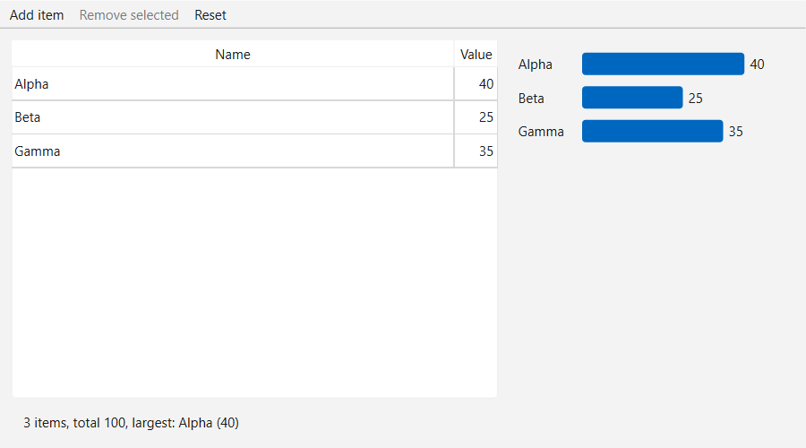

# Observer / MVC demo (Qt Widgets)

One model, three views, zero coupling. The editable table, the bar chart, and the summary line all watch the same `ItemModel`. Change anything anywhere and all three update together, yet none of them knows the others exist.

This is the observer pattern exactly as Qt ships it. `QAbstractTableModel` is the subject, `QTableView` subscribes natively, and the chart and summary are ordinary widgets hooked to the same five signals: `dataChanged`, `rowsInserted`, `rowsRemoved`, `modelReset`, `destroyed`. The takeaway: a "view" does not have to be a table on a screen. Anything that listens is a view. I wrote about why I consider this the one indispensable design pattern in [Observer, Pub-Sub, MVC](https://makarandkokane.github.io/articles/software-development-tip-observer-pub-sub-mvc.html).

That fifth signal is the one most demos leave out. The subject going away is a state change like any other, so both hand-written views observe it, clear their pointer, and say so on screen rather than quietly painting blank. Qt itself treats it that way: `QAbstractItemViewPrivate` declares `modelDestroyed()` right alongside `rowsInserted` and `layoutChanged`, and keeps a plain model pointer while reserving `QPointer` for the delegate. A `QPointer` on the model would have made the crash go away, but it would also have turned "the subject is gone" into "the subject is empty", and telling those two apart is the whole point of the exercise.

## Code tour

| File | Role |
|------|------|
| `src/ItemModel.h/.cpp` | The subject. Single source of truth, emits the change signals. |
| `src/BarChartWidget.h/.cpp` | Observer. A custom-painted chart that repaints on every signal. |
| `src/SummaryPanel.h/.cpp` | Observer. Count, total, and largest item, recomputed on every signal. |
| `src/MainWindow.h/.cpp` | The mediator. The only class that knows the model and all the views. |
| `src/main.cpp` | Entry point. |

## Build and run

Any platform with Qt 6 and CMake:

    cmake -S . -B build -DCMAKE_PREFIX_PATH=<path-to-your-Qt6-kit>
    cmake --build build --config Release

Windows, Qt 6.8, MSVC 2022:

    cmake -S . -B build -DCMAKE_PREFIX_PATH=C:\Qt\6.8.8\msvc2022_64
    cmake --build build --config Release
    build\Release\observer-mvc.exe

One small extra: run it with `--screenshot shot.png` and the app captures its own window to a PNG and exits. That is how the image above was made.
